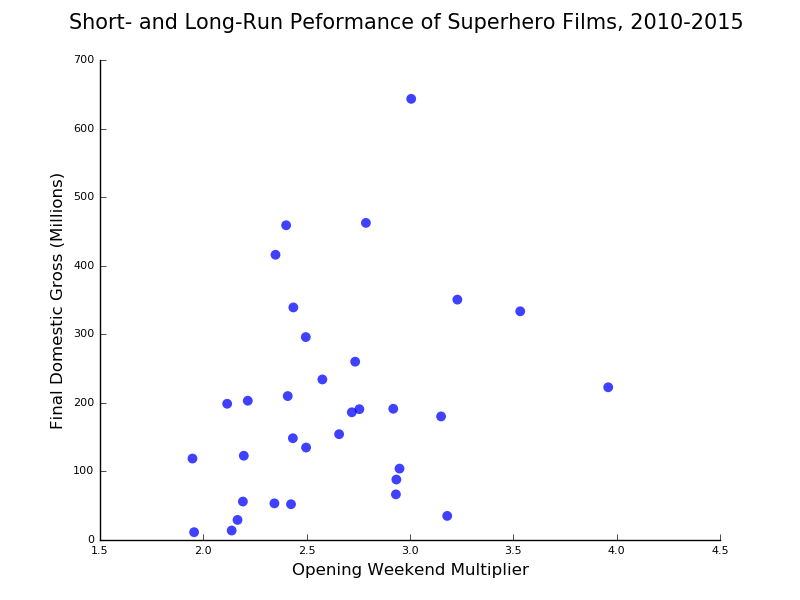
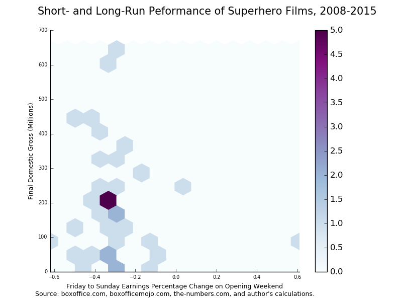
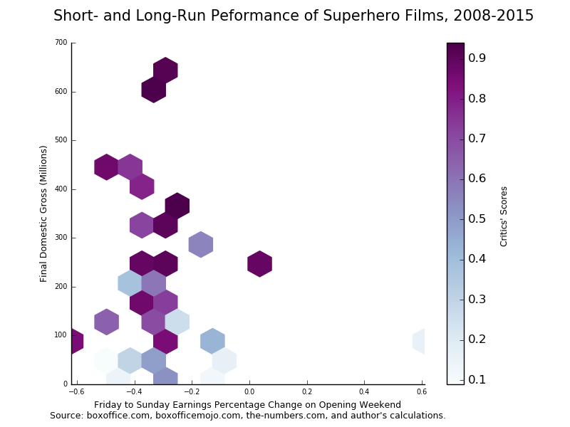
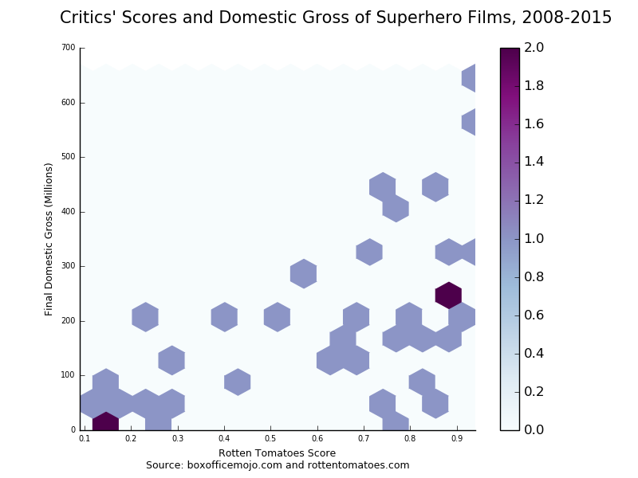

# Much Ado About Batman

A lot has been and will be written about the box-office adventures of Batman vs. Superman, particularly day-to-day and weekend-to-weekend percentage drops in ticket sales. Robert Cain over at [*Forbes*](http://www.forbes.com/sites/robcain/2016/03/28/batman-v-superman-sets-record-with-worst-friday-sunday-drop-for-superhero-pics/#fffce246d72c) had a particularly interesting breakdown of the film's opening weekend performance. But what does it mean for the long haul? If you're looking for a movie that proves you can't predict future performance based on day-to-day totals or the percentage of critics who hate a film on Rotten Tomatoes, this is one of 'em.

Cain wrote at *Forbes*:

> According to the figures I’ve compiled from Boxofficemojo.com, Batman v Superman has set a new record for the worst Friday-to-Sunday drop for a superhero movie release in modern North American box office history. In dropping 55% from its $82 million Friday debut to its $37 million gross on Sunday, it pummeled all prior records for weakness in theatrical staying power. It even beat the nearly universally reviled and now long-forgotten Fantastic Four reboot, which dropped a comparatively modest 48% across its opening weekend in the summer of 2015.

He included a chart that indicates "superhero movies that don’t hold up well over their first weekend tend not to sustain much energy at the box office over the longer course of their theatrical runs." While he admitted the correlations are not perfect (between final domestic gross and the "opening weekend multiplier"), he went on to predict a final domestic box office gross of $409 million for the film. My interest was piqued.

<blockquote class="twitter-tweet" data-lang="en">
<a href="https://twitter.com/robcain">@robcain</a> When you say &quot;the correlations are not perfect,&quot; did you build a regression model? What was the R^2? <a href="https://t.co/NGhjTknT2b">https://t.co/NGhjTknT2b</a>
&mdash; Stats for Geeks (@statsforgeeks) <a href="https://twitter.com/statsforgeeks/status/714472120093245441">March 28, 2016</a></blockquote>

His response:

<blockquote class="twitter-tweet" data-lang="en">
<a href="https://twitter.com/statsforgeeks">@statsforgeeks</a> No, I didn&#39;t. There aren&#39;t enough data points.
&mdash; Robert Cain (@robcain) <a href="https://twitter.com/robcain/status/714474265966284800">March 28, 2016</a></blockquote>

But how can you make a prediction without a prediction model? And if we're talking about the drop in ticket sales between Friday and Sunday, how is the opening weekend multiplier (the total domestic gross/opening weekend gross) a good indicator. For example, The Dark Knight Rises, an undeniably successful superhero film, has a lower multiplier than Big Hero 6, which made half the total of TDKR's domestic run.

I decided to pull together my own data, partly based on his chart and other sources, and give it a shot.

## The Data

Cain's source was "compiled by a Pacific Bridge analysis of boxofficemojo.com data." I threw out the 2016 films such as Deadpool because they are still finishing their box-office runs, and using Wikipedia's list of superhero films by year, added 2012 films "Chronicle" and "Dredd." [1] Because I removed a year, I added the following films from 2010, "Kick-Ass," "Jonah Hex" and "Iron Man 2." Opening weekend numbers were taken from the site ProBoxOffice.com. I double-checked these numbers with boxofficemojo.com where they were available. I also added the Rotten Tomatoes score, but more on that later.

Finally, because we're talking about money, I adjusted all totals to 2015 dollars. Here's what the data look like in Python.

        :::python
        #creating the data frame
        import numpy as np
        import pandas as pd
        import matplotlib.pyplot as plt
        
        movies = ["Fantastic Four","The Dark Knight Rises","Kick-Ass 2", "Avengers: Age of Ultron", "Iron Man 3", "Captain America: Winter Soldier", "X-Men: First Class", "The Amazing Spider-Man 2", "Thor", "Ant-Man","Guardians of the Galaxy","Captain America: First Avenger","Thor: The Dark World","The Wolverine","TMNT (2014)", "Green Lantern","Marvel's The Avengers","X-Men: Days of Future Past","Green Hornet","Ghost Rider: Spirit of Vengeance","Big Hero 6","Man of Steel","Chronicle","Dredd","Kick-Ass","Jonah Hex","Iron Man 2"]
        
        release_year = ["2015","2012","2013","2015","2013","2014","2011","2014","2011","2015","2014","2011","2013","2013","2014","2011","2012","2014","2011","2012","2014","2013","2012","2012","2010","2010","2010"]
        
        first_fri = [11.28,75.8,5.83,84.4,68.9,36.9,21.4,35.2,25.5,22.6,37.8,25.7,31.9,20.7,25.6,21.4,80.8,35.5,11.1,6.9,15.8,44.03,8.65,2.2,7.6,1.9,51.2]
        
        first_sun = [5.83,40.2,3.31,50.3,43,23.4,14,23.3,16.9,15.1,25.5,17.4,21.8,14.3,17.8,15.1,57.1,26,9.8,6.5,16.4,36.3,3.25,1.6,4.9,1.6,31.1]
        
        opening = [25.6,160.8,13.3,191.2,174.1,95,55.1,91.6,65.7,57.2,94.3,65,85.7,53.1,65.5,53.1,207.4,90.8,33.5,22.1,56.2,116.6,22,6.27,19.8,5.37,128.1]
        
        final_gross = [56.1,448.1,28.8,459,409,259.8,146.4,202.9,181,180.2,333.2,176.7,206.4,132.6,191.2,116.6,623.4,233.9,98.8,51.8,222.5,291,64.5,13.4,48,10.5,312]
        
        critics = [.09,.87,.30,.75,.79,.89,.87,.53,.77,.80,.91,.79,.67,.70,.21,.26,.92,.91,.43,.17,.89,.56,.85,.78,.76,.12,.72]
        
        d = { "Release Year" : pd.Series(release_year, index=movies),
              "First Friday Gross" : pd.Series(first_fri, index=movies),
              "First Sunday Gross" : pd.Series(first_sun, index=movies),
              "Final Gross" : pd.Series(final_gross, index=movies),
              "Critics Score": pd.Series(critics, index=movies)}
        
        df = pd.DataFrame(d)

An example of taking into account inflation:
  
        :::python
        # calculating earnings in 2015 dollars
        # inflation, 2010 = 8.7%, 2011 = 5.4%, 2012 = 3.2%, 2013 = 1.7%, 2014 = 0.1%
        
        # 2010
        df.ix[df['Release Year'] == '2010','First Friday Gross'] = df.ix[df['Release Year'] == '2010','First Friday Gross'] * 1.087
        df.ix[df['Release Year'] == '2010','First Sunday Gross'] = df.ix[df['Release Year'] == '2010','First Sunday Gross'] * 1.087
        df.ix[df['Release Year'] == '2010','Opening Weekend'] = df.ix[df['Release Year'] == '2010','Opening Weekend'] * 1.087
        df.ix[df['Release Year'] == '2010','Final Gross'] = df.ix[df['Release Year'] == '2010','Final Gross'] * 1.087

And finally, creating columns for the percentage earnings dropped Friday to Sunday and the opening weekend mulitplier.

        :::python
        # friday to sunday percentage change
        df = df.assign(perc_change= ((df["FirstSundayGross"] - df["FirstFridayGross"])/df["FirstFridayGross"]).round(2))
        
        # opening weekend multiplier
        df = df.assign(multiplier=df["FinalGross"]/df["OpeningWeekend"])

Here's the final chart:

<table border="1" class="dataframe">  <thead>    <tr style="text-align: right;">      <th></th>      <th>Critics Score</th>      <th>Final Gross</th>      <th>First Friday Gross</th>      <th>First Sunday Gross</th>      <th>Opening Weekend</th>      <th>Release Year</th>      <th>perc_change</th>      <th>multiplier</th>    </tr>  </thead>  <tbody>    <tr>      <th>Fantastic Four</th>      <td>0.09</td>      <td>56.1000</td>      <td>11.28000</td>      <td>5.83000</td>      <td>25.60000</td>      <td>2015</td>      <td>-0.483156</td>      <td>2.191406</td>    </tr>    <tr>      <th>The Dark Knight Rises</th>      <td>0.87</td>      <td>462.4392</td>      <td>78.22560</td>      <td>41.48640</td>      <td>165.94560</td>      <td>2012</td>      <td>-0.469657</td>      <td>2.786692</td>    </tr>    <tr>      <th>Kick-Ass 2</th>      <td>0.30</td>      <td>29.2896</td>      <td>5.92911</td>      <td>3.36627</td>      <td>13.52610</td>      <td>2013</td>      <td>-0.432247</td>      <td>2.165414</td>    </tr>    <tr>      <th>Avengers: Age of Ultron</th>      <td>0.75</td>      <td>459.0000</td>      <td>84.40000</td>      <td>50.30000</td>      <td>191.20000</td>      <td>2015</td>      <td>-0.404028</td>      <td>2.400628</td>    </tr>    <tr>      <th>Iron Man 3</th>      <td>0.79</td>      <td>415.9530</td>      <td>70.07130</td>      <td>43.73100</td>      <td>177.05970</td>      <td>2013</td>      <td>-0.375907</td>      <td>2.349225</td>    </tr>    <tr>      <th>Captain America: Winter Soldier</th>      <td>0.89</td>      <td>259.8000</td>      <td>36.93690</td>      <td>23.40000</td>      <td>95.00000</td>      <td>2014</td>      <td>-0.366487</td>      <td>2.734737</td>    </tr>    <tr>      <th>X-Men: First Class</th>      <td>0.87</td>      <td>154.3056</td>      <td>22.55560</td>      <td>14.75600</td>      <td>58.07540</td>      <td>2011</td>      <td>-0.345794</td>      <td>2.656987</td>    </tr>    <tr>      <th>The Amazing Spider-Man 2</th>      <td>0.53</td>      <td>202.9000</td>      <td>35.23520</td>      <td>23.30000</td>      <td>91.60000</td>      <td>2014</td>      <td>-0.338729</td>      <td>2.215066</td>    </tr>    <tr>      <th>Thor</th>      <td>0.77</td>      <td>190.7740</td>      <td>26.87700</td>      <td>17.81260</td>      <td>69.24780</td>      <td>2011</td>      <td>-0.337255</td>      <td>2.754947</td>    </tr>    <tr>      <th>Ant-Man</th>      <td>0.80</td>      <td>180.2000</td>      <td>22.60000</td>      <td>15.10000</td>      <td>57.20000</td>      <td>2015</td>      <td>-0.331858</td>      <td>3.150350</td>    </tr>    <tr>      <th>Guardians of the Galaxy</th>      <td>0.91</td>      <td>333.2000</td>      <td>37.83780</td>      <td>25.50000</td>      <td>94.30000</td>      <td>2014</td>      <td>-0.326071</td>      <td>3.533404</td>    </tr>    <tr>      <th>Captain America: First Avenger</th>      <td>0.79</td>      <td>186.2418</td>      <td>27.08780</td>      <td>18.33960</td>      <td>68.51000</td>      <td>2011</td>      <td>-0.322957</td>      <td>2.718462</td>    </tr>    <tr>      <th>Thor: The Dark World</th>      <td>0.67</td>      <td>209.9088</td>      <td>32.44230</td>      <td>22.17060</td>      <td>87.15690</td>      <td>2013</td>      <td>-0.316614</td>      <td>2.408401</td>    </tr>    <tr>      <th>The Wolverine</th>      <td>0.70</td>      <td>134.8542</td>      <td>21.05190</td>      <td>14.54310</td>      <td>54.00270</td>      <td>2013</td>      <td>-0.309179</td>      <td>2.497175</td>    </tr>    <tr>      <th>TMNT (2014)</th>      <td>0.21</td>      <td>191.2000</td>      <td>25.62560</td>      <td>17.80000</td>      <td>65.50000</td>      <td>2014</td>      <td>-0.305382</td>      <td>2.919084</td>    </tr>    <tr>      <th>Green Lantern</th>      <td>0.26</td>      <td>122.8964</td>      <td>22.55560</td>      <td>15.91540</td>      <td>55.96740</td>      <td>2011</td>      <td>-0.294393</td>      <td>2.195857</td>    </tr>    <tr>      <th>Marvel\'s The Avengers</th>      <td>0.92</td>      <td>643.3488</td>      <td>83.38560</td>      <td>58.92720</td>      <td>214.03680</td>      <td>2012</td>      <td>-0.293317</td>      <td>3.005786</td>    </tr>    <tr>      <th>X-Men: Days of Future Past</th>      <td>0.91</td>      <td>233.9000</td>      <td>35.53550</td>      <td>26.00000</td>      <td>90.80000</td>      <td>2014</td>      <td>-0.268337</td>      <td>2.575991</td>    </tr>    <tr>      <th>Green Hornet</th>      <td>0.43</td>      <td>104.1352</td>      <td>11.69940</td>      <td>10.32920</td>      <td>35.30900</td>      <td>2011</td>      <td>-0.117117</td>      <td>2.949254</td>    </tr>    <tr>      <th>Ghost Rider: Spirit of Vengeance</th>      <td>0.17</td>      <td>53.4576</td>      <td>7.12080</td>      <td>6.70800</td>      <td>22.80720</td>      <td>2012</td>      <td>-0.057971</td>      <td>2.343891</td>    </tr>    <tr>      <th>Big Hero 6</th>      <td>0.89</td>      <td>222.5000</td>      <td>15.81580</td>      <td>16.40000</td>      <td>56.20000</td>      <td>2014</td>      <td>0.036938</td>      <td>3.959075</td>    </tr>    <tr>      <th>Man of Steel</th>      <td>0.56</td>      <td>295.9470</td>      <td>44.77851</td>      <td>36.91710</td>      <td>118.58220</td>      <td>2013</td>      <td>-0.175562</td>      <td>2.495712</td>    </tr>    <tr>      <th>Chronicle</th>      <td>0.85</td>      <td>66.5640</td>      <td>8.92680</td>      <td>3.35400</td>      <td>22.70400</td>      <td>2012</td>      <td>-0.624277</td>      <td>2.931818</td>    </tr>    <tr>      <th>Dredd</th>      <td>0.78</td>      <td>13.8288</td>      <td>2.27040</td>      <td>1.65120</td>      <td>6.47064</td>      <td>2012</td>      <td>-0.272727</td>      <td>2.137161</td>    </tr>    <tr>      <th>Kick-Ass</th>      <td>0.76</td>      <td>52.1760</td>      <td>8.26120</td>      <td>5.32630</td>      <td>21.52260</td>      <td>2010</td>      <td>-0.355263</td>      <td>2.424242</td>    </tr>    <tr>      <th>Jonah Hex</th>      <td>0.12</td>      <td>11.4135</td>      <td>2.06530</td>      <td>1.73920</td>      <td>5.83719</td>      <td>2010</td>      <td>-0.157895</td>      <td>1.955307</td>    </tr>    <tr>      <th>Iron Man 2</th>      <td>0.72</td>      <td>339.1440</td>      <td>55.65440</td>      <td>33.80570</td>      <td>139.24470</td>      <td>2010</td>      <td>-0.392578</td>      <td>2.435597</td>    </tr>  </tbody></table>

## The Correlations Really Aren't Perfect

First I plotted "final domestic gross" versus "opening weekend multiplier."

The correlation between these two variables is 0.32, which statistically speaking is weakly positive -- "positive" meaning that an increase in the multiplier reflects an increase in final gross, not positive as in "it looks good!" If you were looking at this relationship to fit a model, you would want to look at other variables. One major reason for this is the formula used to calculate the opening weekend multiplier contains the value you are trying to predict! It's like trying to asking a question with the answer. Since your y in a regression model is supposed to be an independent variable, we have to toss this out.

Next, I plotted "final domestic gross" versus the Friday-to-Sunday drop in ticket sales.

The correlation between these two variables is -0.11, which is really weak *and* negative, suggesting a lower percentage drop equals a lower domestic gross. That's confusing until you look at films like "Jonah Hex" and "Ghost Rider: Spirit of Vengeance." Both performed miserably at the box office, but the Friday and Sunday earnings didn't really differ that much. But again, don't take much stock in this, because it's an extremely weak correlation. However, something interesting happens when you group by critics' scores.

With the exception of two outliers, "Dredd" and "Big Hero 6," most films with high scores sit in a narrow band between the -40% and -20% Friday to Sunday percentage drop.

Which leads me to the last variable I want to explore: final domestic gross versus critics' scores.

The correlation between these two variables is 0.52, which while not strong, is a lot stronger than the other variables explored. It also follows common sense: Films with better reviews *usually* are going to attract a wider audience.

## Catchy Subhed

Let's say I wanted to build a linear regression model to predict final domestic gross. Based on the evidence above, a single variable is just not going to cut it.

## The Rising Dark Knight Lifts All Capes

In the end, Cain's response, that there are not enough data points, is what holds us back from making an accurate prediction.

[1] I left out "The Amazing Spider-Man" as that film was released mid-week and skews the whole Friday to Sunday model.