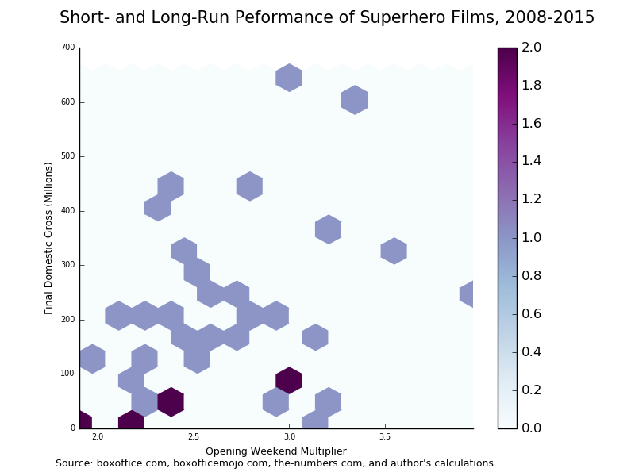

# Much Ado About Batman

A lot has been and will be written about the box-office adventures of Batman vs. Superman, particularly day-to-day and weekend-to-weekend percentage drops in ticket sales. Robert Cain over at [*Forbes*](http://www.forbes.com/sites/robcain/2016/03/28/batman-v-superman-sets-record-with-worst-friday-sunday-drop-for-superhero-pics/#fffce246d72c) had a particularly interesting breakdown of the film's opening weekend performance. But what does it mean for the long haul? If you're looking for a movie that proves you can't predict future performance based on day-to-day totals or the percentage of critics who hate a film on Rotten Tomatoes, this is one of 'em.

Cain wrote at *Forbes*:

> According to the figures I've compiled from Boxofficemojo.com, Batman v Superman has set a new record for the worst Friday-to-Sunday drop for a superhero movie release in modern North American box office history. In dropping 55% from its $82 million Friday debut to its $37 million gross on Sunday, it pummeled all prior records for weakness in theatrical staying power. It even beat the nearly universally reviled and now long-forgotten Fantastic Four reboot, which dropped a comparatively modest 48% across its opening weekend in the summer of 2015.

He included a chart that indicates "superhero movies that don't hold up well over their first weekend tend not to sustain much energy at the box office over the longer course of their theatrical runs." While he admitted the correlations are not perfect (between final domestic gross and the "opening weekend multiplier"), he went on to predict a final domestic box office gross of $409 million for the film. My interest was piqued.

<blockquote class="twitter-tweet" data-lang="en">
<a href="https://twitter.com/robcain">@robcain</a> When you say &quot;the correlations are not perfect,&quot; did you build a regression model? What was the R^2? <a href="https://t.co/NGhjTknT2b">https://t.co/NGhjTknT2b</a>
&mdash; Stats for Geeks (@statsforgeeks) <a href="https://twitter.com/statsforgeeks/status/714472120093245441">March 28, 2016</a></blockquote>

His response:

<blockquote class="twitter-tweet" data-lang="en">
<a href="https://twitter.com/statsforgeeks">@statsforgeeks</a> No, I didn&#39;t. There aren&#39;t enough data points.
&mdash; Robert Cain (@robcain) <a href="https://twitter.com/robcain/status/714474265966284800">March 28, 2016</a></blockquote>

But how can you make a prediction without a prediction model? And if we're talking about the drop in ticket sales between Friday and Sunday, how is the opening weekend multiplier (the total domestic gross/opening weekend gross) a good indicator. For example, The Dark Knight Rises, an undeniably successful superhero film, has a lower multiplier than Big Hero 6, which made half the total of TDKR's domestic run.

I decided to pull together my own data, partly based on his chart and other sources, and give it a shot.

## The Data

Cain's source was "compiled by a Pacific Bridge analysis of boxofficemojo.com data." I threw out the 2016 films such as Deadpool because they are still finishing their box-office runs, and using Wikipedia's list of superhero films by year, added 2012 films "Chronicle" and "Dredd." [1] Because I removed a year and obviously needed more data points, I added films going back to 2008, the year of "Iron Man" and "The Dark Knight" -- arguably, the beginning of the mega-blockbuster superhero film era. Opening weekend numbers were taken from the sites ProBoxOffice.com and The Numbers. I double-checked these stats with boxofficemojo.com where they were available. I also added the Rotten Tomatoes score, but more on that later.

Finally, because we're talking about money, I adjusted all totals to 2015 dollars. Here's what the data look like in Python[2].

        :::python
        import numpy as np
        import pandas as pd
        import matplotlib.pyplot as plt
        import statsmodels.formula.api as smf
        
        movies = ["Fantastic Four","The Dark Knight Rises","Kick-Ass 2", "Avengers: Age of Ultron", "Iron Man 3", "Captain America: Winter Soldier", "X-Men: First Class", "The Amazing Spider-Man 2", "Thor", "Ant-Man","Guardians of the Galaxy","Captain America: First Avenger","Thor: The Dark World","The Wolverine","TMNT (2014)", "Green Lantern","Marvel's The Avengers","X-Men: Days of Future Past","Green Hornet","Ghost Rider: Spirit of Vengeance","Big Hero 6","Man of Steel","Chronicle","Dredd","Kick-Ass","Jonah Hex","Iron Man 2","X-Men Origins: Wolverine","Watchmen","Push","Jumper","Iron Man","The Incredible Hulk","Hellboy II: The Golden Army","The Dark Knight","Punisher: War Zone","The Spirit"]
        
        release_year = ["2015","2012","2013","2015","2013","2014","2011","2014","2011","2015","2014","2011","2013","2013","2014","2011","2012","2014","2011","2012","2014","2013","2012","2012","2010","2010","2010","2009","2009","2009","2008","2008","2008","2008","2008","2008","2008"]
        
        first_fri = [11.28,75.8,5.83,84.4,68.9,36.9,21.4,35.2,25.5,22.6,37.8,25.7,31.9,20.7,25.6,21.4,80.8,35.5,11.1,6.9,15.8,44.03,8.65,2.2,7.6,1.9,51.2,34.4,24.5,3.5,6.6,35.2,21.4,13.7,67.1,1.6,3.8]
        
        first_sun = [5.83,40.2,3.31,50.3,43,23.4,14,23.3,16.9,15.1,25.5,17.4,21.8,14.3,17.8,15.1,57.1,26,9.8,6.5,16.4,36.3,3.25,1.6,4.9,1.6,31.1,21.3,12.3,2.4,10.6,26,15.5,9.2,43.5,1.1,2.1]
        
        opening = [25.6,160.8,13.3,191.2,174.1,95,55.1,91.6,65.7,57.2,94.3,65,85.7,53.1,65.5,53.1,207.4,90.8,33.5,22.1,56.2,116.6,22,6.27,19.8,5.37,128.1,85,55.2,10,27.3,98.6,55.4,34.5,158.4,4.2,6.4]
        
        final_gross = [56.1,448.1,28.8,459,409,259.8,146.4,202.9,181,180.2,333.2,176.7,206.4,132.6,191.2,116.6,623.4,233.9,98.8,51.8,222.5,291,64.5,13.4,48,10.5,312,179.8,107.5,31.8,80.1,318.4,134.8,75.9,534.8,8,19.8]
        
        critics = [.09,.87,.30,.75,.79,.89,.87,.53,.77,.80,.91,.79,.67,.70,.21,.26,.92,.91,.43,.17,.89,.56,.85,.78,.76,.12,.72,.38,.65,.23,.16,.94,.67,.85,.94,.27,.14]
        
        d = { "Release Year" : pd.Series(release_year, index=movies),
              "FirstFridayGross" : pd.Series(first_fri, index=movies),
              "FirstSundayGross" : pd.Series(first_sun, index=movies),
              "OpeningWeekend" : pd.Series(opening, index=movies),
              "FinalGross" : pd.Series(final_gross, index=movies),
              "CriticsScores": pd.Series(critics, index=movies)}
        
        df = pd.DataFrame(d)

An example of taking into account inflation:
  
        :::python
        # calculating earnings in 2015 dollars
        # inflation, 2008 = 10.1%, 2009 = 10.5%, 2010 = 8.7%, 2011 = 5.4%, 2012 = 3.2%, 2013 = 1.7%, 2014 = 0.1%
        
        # 2008
        df.ix[df['Release Year'] == '2008','FirstFridayGross'] = df.ix[df['Release Year'] == '2008','FirstFridayGross'] * 1.101
        df.ix[df['Release Year'] == '2008','FirstSundayGross'] = df.ix[df['Release Year'] == '2008','FirstSundayGross'] * 1.101
        df.ix[df['Release Year'] == '2008','OpeningWeekend'] = df.ix[df['Release Year'] == '2008','OpeningWeekend'] * 1.101
        df.ix[df['Release Year'] == '2008','FinalGross'] = df.ix[df['Release Year'] == '2008','FinalGross'] * 1.101

And finally, creating columns for the percentage earnings dropped Friday to Sunday and the opening weekend mulitplier.

        :::python
        # friday to sunday percentage change
        df = df.assign(perc_change= ((df["FirstSundayGross"] - df["FirstFridayGross"])/df["FirstFridayGross"]).round(2))
        
        # opening weekend multiplier
        df = df.assign(multiplier=df["FinalGross"]/df["OpeningWeekend"])

Here's the final chart, sorted by final domestic gross:

<table border="1" class="dataframe table">
  <thead>
    <tr style="text-align: right;">
      <th></th>
      <th>CriticsScores</th>
      <th>FinalGross</th>
      <th>FirstFridayGross</th>
      <th>FirstSundayGross</th>
      <th>OpeningWeekend</th>
      <th>Release Year</th>
      <th>perc_change</th>
      <th>multiplier</th>
    </tr>
  </thead>
  <tbody>
    <tr>
      <th>Marvel's The Avengers</th>
      <td>0.92</td>
      <td>643.3488</td>
      <td>83.38560</td>
      <td>58.92720</td>
      <td>214.03680</td>
      <td>2012</td>
      <td>-0.29</td>
      <td>3.005786</td>
    </tr>
    <tr>
      <th>The Dark Knight</th>
      <td>0.94</td>
      <td>588.8148</td>
      <td>73.87710</td>
      <td>47.89350</td>
      <td>174.39840</td>
      <td>2008</td>
      <td>-0.35</td>
      <td>3.376263</td>
    </tr>
    <tr>
      <th>The Dark Knight Rises</th>
      <td>0.87</td>
      <td>462.4392</td>
      <td>78.22560</td>
      <td>41.48640</td>
      <td>165.94560</td>
      <td>2012</td>
      <td>-0.47</td>
      <td>2.786692</td>
    </tr>
    <tr>
      <th>Avengers: Age of Ultron</th>
      <td>0.75</td>
      <td>459.0000</td>
      <td>84.40000</td>
      <td>50.30000</td>
      <td>191.20000</td>
      <td>2015</td>
      <td>-0.40</td>
      <td>2.400628</td>
    </tr>
    <tr>
      <th>Iron Man 3</th>
      <td>0.79</td>
      <td>415.9530</td>
      <td>70.07130</td>
      <td>43.73100</td>
      <td>177.05970</td>
      <td>2013</td>
      <td>-0.38</td>
      <td>2.349225</td>
    </tr>
    <tr>
      <th>Iron Man</th>
      <td>0.94</td>
      <td>350.5584</td>
      <td>38.75520</td>
      <td>28.62600</td>
      <td>108.55860</td>
      <td>2008</td>
      <td>-0.26</td>
      <td>3.229209</td>
    </tr>
    <tr>
      <th>Iron Man 2</th>
      <td>0.72</td>
      <td>339.1440</td>
      <td>55.65440</td>
      <td>33.80570</td>
      <td>139.24470</td>
      <td>2010</td>
      <td>-0.39</td>
      <td>2.435597</td>
    </tr>
    <tr>
      <th>Guardians of the Galaxy</th>
      <td>0.91</td>
      <td>333.5332</td>
      <td>37.83780</td>
      <td>25.52550</td>
      <td>94.39430</td>
      <td>2014</td>
      <td>-0.33</td>
      <td>3.533404</td>
    </tr>
    <tr>
      <th>Man of Steel</th>
      <td>0.56</td>
      <td>295.9470</td>
      <td>44.77851</td>
      <td>36.91710</td>
      <td>118.58220</td>
      <td>2013</td>
      <td>-0.18</td>
      <td>2.495712</td>
    </tr>
    <tr>
      <th>Captain America: Winter Soldier</th>
      <td>0.89</td>
      <td>260.0598</td>
      <td>36.93690</td>
      <td>23.42340</td>
      <td>95.09500</td>
      <td>2014</td>
      <td>-0.37</td>
      <td>2.734737</td>
    </tr>
    <tr>
      <th>X-Men: Days of Future Past</th>
      <td>0.91</td>
      <td>234.1339</td>
      <td>35.53550</td>
      <td>26.02600</td>
      <td>90.89080</td>
      <td>2014</td>
      <td>-0.27</td>
      <td>2.575991</td>
    </tr>
    <tr>
      <th>Big Hero 6</th>
      <td>0.89</td>
      <td>222.7225</td>
      <td>15.81580</td>
      <td>16.41640</td>
      <td>56.25620</td>
      <td>2014</td>
      <td>0.04</td>
      <td>3.959075</td>
    </tr>
    <tr>
      <th>Thor: The Dark World</th>
      <td>0.67</td>
      <td>209.9088</td>
      <td>32.44230</td>
      <td>22.17060</td>
      <td>87.15690</td>
      <td>2013</td>
      <td>-0.32</td>
      <td>2.408401</td>
    </tr>
    <tr>
      <th>The Amazing Spider-Man 2</th>
      <td>0.53</td>
      <td>203.1029</td>
      <td>35.23520</td>
      <td>23.32330</td>
      <td>91.69160</td>
      <td>2014</td>
      <td>-0.34</td>
      <td>2.215066</td>
    </tr>
    <tr>
      <th>X-Men Origins: Wolverine</th>
      <td>0.38</td>
      <td>198.6790</td>
      <td>38.01200</td>
      <td>23.53650</td>
      <td>93.92500</td>
      <td>2009</td>
      <td>-0.38</td>
      <td>2.115294</td>
    </tr>
    <tr>
      <th>TMNT (2014)</th>
      <td>0.21</td>
      <td>191.3912</td>
      <td>25.62560</td>
      <td>17.81780</td>
      <td>65.56550</td>
      <td>2014</td>
      <td>-0.30</td>
      <td>2.919084</td>
    </tr>
    <tr>
      <th>Thor</th>
      <td>0.77</td>
      <td>190.7740</td>
      <td>26.87700</td>
      <td>17.81260</td>
      <td>69.24780</td>
      <td>2011</td>
      <td>-0.34</td>
      <td>2.754947</td>
    </tr>
    <tr>
      <th>Captain America: First Avenger</th>
      <td>0.79</td>
      <td>186.2418</td>
      <td>27.08780</td>
      <td>18.33960</td>
      <td>68.51000</td>
      <td>2011</td>
      <td>-0.32</td>
      <td>2.718462</td>
    </tr>
    <tr>
      <th>Ant-Man</th>
      <td>0.80</td>
      <td>180.2000</td>
      <td>22.60000</td>
      <td>15.10000</td>
      <td>57.20000</td>
      <td>2015</td>
      <td>-0.33</td>
      <td>3.150350</td>
    </tr>
    <tr>
      <th>X-Men: First Class</th>
      <td>0.87</td>
      <td>154.3056</td>
      <td>22.55560</td>
      <td>14.75600</td>
      <td>58.07540</td>
      <td>2011</td>
      <td>-0.35</td>
      <td>2.656987</td>
    </tr>
    <tr>
      <th>The Incredible Hulk</th>
      <td>0.67</td>
      <td>148.4148</td>
      <td>23.56140</td>
      <td>17.06550</td>
      <td>60.99540</td>
      <td>2008</td>
      <td>-0.28</td>
      <td>2.433213</td>
    </tr>
    <tr>
      <th>The Wolverine</th>
      <td>0.70</td>
      <td>134.8542</td>
      <td>21.05190</td>
      <td>14.54310</td>
      <td>54.00270</td>
      <td>2013</td>
      <td>-0.31</td>
      <td>2.497175</td>
    </tr>
    <tr>
      <th>Green Lantern</th>
      <td>0.26</td>
      <td>122.8964</td>
      <td>22.55560</td>
      <td>15.91540</td>
      <td>55.96740</td>
      <td>2011</td>
      <td>-0.29</td>
      <td>2.195857</td>
    </tr>
    <tr>
      <th>Watchmen</th>
      <td>0.65</td>
      <td>118.7875</td>
      <td>27.07250</td>
      <td>13.59150</td>
      <td>60.99600</td>
      <td>2009</td>
      <td>-0.50</td>
      <td>1.947464</td>
    </tr>
    <tr>
      <th>Green Hornet</th>
      <td>0.43</td>
      <td>104.1352</td>
      <td>11.69940</td>
      <td>10.32920</td>
      <td>35.30900</td>
      <td>2011</td>
      <td>-0.12</td>
      <td>2.949254</td>
    </tr>
    <tr>
      <th>Jumper</th>
      <td>0.16</td>
      <td>88.1901</td>
      <td>7.26660</td>
      <td>11.67060</td>
      <td>30.05730</td>
      <td>2008</td>
      <td>0.61</td>
      <td>2.934066</td>
    </tr>
    <tr>
      <th>Hellboy II: The Golden Army</th>
      <td>0.85</td>
      <td>83.5659</td>
      <td>15.08370</td>
      <td>10.12920</td>
      <td>37.98450</td>
      <td>2008</td>
      <td>-0.33</td>
      <td>2.200000</td>
    </tr>
    <tr>
      <th>Chronicle</th>
      <td>0.85</td>
      <td>66.5640</td>
      <td>8.92680</td>
      <td>3.35400</td>
      <td>22.70400</td>
      <td>2012</td>
      <td>-0.62</td>
      <td>2.931818</td>
    </tr>
    <tr>
      <th>Fantastic Four</th>
      <td>0.09</td>
      <td>56.1000</td>
      <td>11.28000</td>
      <td>5.83000</td>
      <td>25.60000</td>
      <td>2015</td>
      <td>-0.48</td>
      <td>2.191406</td>
    </tr>
    <tr>
      <th>Ghost Rider: Spirit of Vengeance</th>
      <td>0.17</td>
      <td>53.4576</td>
      <td>7.12080</td>
      <td>6.70800</td>
      <td>22.80720</td>
      <td>2012</td>
      <td>-0.06</td>
      <td>2.343891</td>
    </tr>
    <tr>
      <th>Kick-Ass</th>
      <td>0.76</td>
      <td>52.1760</td>
      <td>8.26120</td>
      <td>5.32630</td>
      <td>21.52260</td>
      <td>2010</td>
      <td>-0.36</td>
      <td>2.424242</td>
    </tr>
    <tr>
      <th>Push</th>
      <td>0.23</td>
      <td>35.1390</td>
      <td>3.86750</td>
      <td>2.65200</td>
      <td>11.05000</td>
      <td>2009</td>
      <td>-0.31</td>
      <td>3.180000</td>
    </tr>
    <tr>
      <th>Kick-Ass 2</th>
      <td>0.30</td>
      <td>29.2896</td>
      <td>5.92911</td>
      <td>3.36627</td>
      <td>13.52610</td>
      <td>2013</td>
      <td>-0.43</td>
      <td>2.165414</td>
    </tr>
    <tr>
      <th>The Spirit</th>
      <td>0.14</td>
      <td>21.7998</td>
      <td>4.18380</td>
      <td>2.31210</td>
      <td>7.04640</td>
      <td>2008</td>
      <td>-0.45</td>
      <td>3.093750</td>
    </tr>
    <tr>
      <th>Dredd</th>
      <td>0.78</td>
      <td>13.8288</td>
      <td>2.27040</td>
      <td>1.65120</td>
      <td>6.47064</td>
      <td>2012</td>
      <td>-0.27</td>
      <td>2.137161</td>
    </tr>
    <tr>
      <th>Jonah Hex</th>
      <td>0.12</td>
      <td>11.4135</td>
      <td>2.06530</td>
      <td>1.73920</td>
      <td>5.83719</td>
      <td>2010</td>
      <td>-0.16</td>
      <td>1.955307</td>
    </tr>
    <tr>
      <th>Punisher: War Zone</th>
      <td>0.27</td>
      <td>8.8080</td>
      <td>1.76160</td>
      <td>1.21110</td>
      <td>4.62420</td>
      <td>2008</td>
      <td>-0.31</td>
      <td>1.904762</td>
    </tr>
  </tbody>
</table>

## The Correlations Really Aren't Perfect

First I plotted "final domestic gross" versus "opening weekend multiplier."

The correlation between these two variables is 0.36, which statistically speaking is weakly positive -- "positive" meaning that an increase in the multiplier reflects an increase in final gross, not positive as in "it looks good!" If you were looking at this relationship to fit a model, you would want to look at other variables. One major reason for this is the formula used to calculate the opening weekend multiplier contains the value you are trying to predict! It's like trying to asking a question with the answer. Since your predictors in a regression model are supposed to be independent, we have to toss this out.

Next, I plotted "final domestic gross" versus the Friday-to-Sunday drop in ticket sales.

The correlation between these two variables is -0.11, which is really weak *and* negative, suggesting a lower percentage drop equals a lower domestic gross. That's confusing until you look at films like "Jonah Hex" and "Ghost Rider: Spirit of Vengeance." Both performed miserably at the box office, but the Friday and Sunday earnings didn't really differ that much. But again, don't take much stock in this, because it's an extremely weak correlation. However, something interesting happens when you group by critics' scores.

With the exception of two outliers, "Dredd" and "Big Hero 6," most films with high scores sit in a narrow band between the -40% and -20% Friday to Sunday percentage drop.

Which leads me to the last variable I want to explore: final domestic gross versus critics' scores.

The correlation between these two variables is 0.59, which while not strong, is a lot stronger than the other variables explored. It also follows common sense: Films with better reviews *usually* are going to attract a wider audience.

## Building a Model

Let's say I wanted to build a linear regression model to predict final domestic gross. Based on the evidence above, a single variable is just not going to cut it. I could start with the critics' scores, but my coefficient of determination (the R^2 I asked Cain about) shows critics' scores only explain about 35% of the variability in the data. We can't use the opening weekend multiplier, so all that's left is the opening weekend percentage change. A multivariate regression model using critics' scores *and* the percentage change would also only explain 35% of the variability. The percentage change variable adds very little to the model.

But hey! This is a blog, not life and death. So let's make a prediction using an imperfect model!

0.6953 + (Critics' Score) * 337.8686 + (percentage change) * 33.7825 = Domestic Gross

0.6953 + (.29*337.8686) + (.55 * 33.7825) = $117M!

That's *less* than the film's take on opening weekend. So here's what went wrong...

## The Rising Dark Knight Lifts All Capes

Yes, Cain's response, that there are not enough data points, is one of the factors that prevents me from making an accurate prediction. But as I proved above, the variables we have for prediction also aren't that great (for superhero films). Certainly with more data, they could improve, but it might be wise to look at other stats as well. Maybe we could take a look at viewers' scores, instead of critics' scores. Maybe movie length plays a part since a shorter movie will have more showtimes (and more opportunities to make money) then a movie that's almost 3 hours long. Who knows.

Even if critics' scores proved reliable, there's also the little fact that Batman V. Superman has been universally reviled by critics. With a 29% Rotten Tomatoes score, it is an outlier that defies prediction.

How did Cain come up with the $409M prediction? He certainly has more experience reporting on the business than I do, so I'll leave that to him and say his method is better than mine.

[1] I left out "The Amazing Spider-Man" and "Hancock" as those films were released mid-week and skew the whole Friday to Sunday model.

[2] This is my first time posting with Python and Markdown. Normally I run everything in R, but this time I thought I would switch things up. It also explains why it took me longer than usual to write this. If you're interested, the GitHub repo for the Python script is [here](https://github.com/mattsedlar/batman-v-supes/blob/master/batman-supes.py).